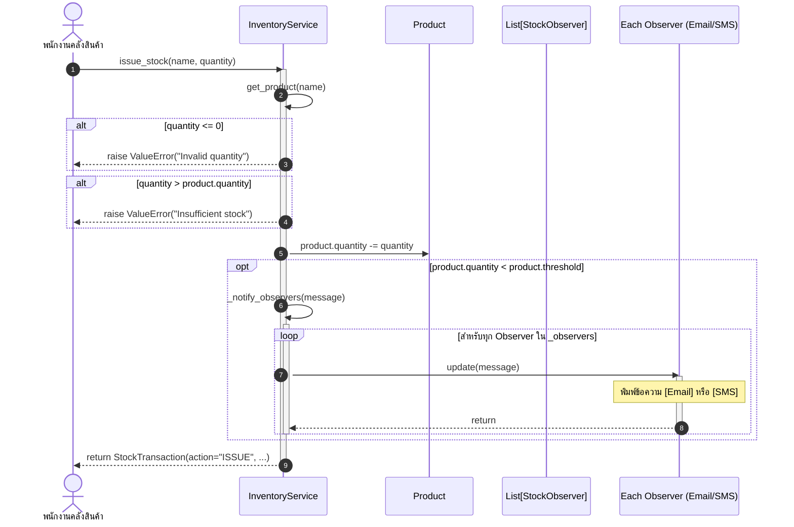

# Sequence Diagram: จ่ายสินค้าจนสต็อกต่ำกว่า Threshold (Observer Pattern)

```mermaid
sequenceDiagram
    autonumber
    actor Staff as พนักงานคลังสินค้า
    participant Service as InventoryService
    participant Prod as Product
    participant Observers as List[StockObserver]
    participant Obs as Each Observer (Email/SMS)

    Staff->>Service: issue_stock(name, quantity)
    activate Service

    Service->>Service: get_product(name)

    alt quantity <= 0
        Service-->>Staff: raise ValueError("Invalid quantity")
    end

    alt quantity > product.quantity
        Service-->>Staff: raise ValueError("Insufficient stock")
    end

    %% ปรับปรุงยอดคงเหลือ
    Service->>Prod: product.quantity -= quantity

    %% แจ้งเตือน Observer ทุกตัว
    opt product.quantity < product.threshold
        Service->>Service: _notify_observers(message)
        activate Service
        loop สำหรับทุก Observer ใน _observers
            Service->>Obs: update(message)
            activate Obs
            Note over Obs: พิมพ์ข้อความ [Email] หรือ [SMS]
            Obs-->>Service: return
            deactivate Obs
        end
        deactivate Service
    end

    Service-->>Staff: return StockTransaction(action="ISSUE", ...)
    deactivate Service
```